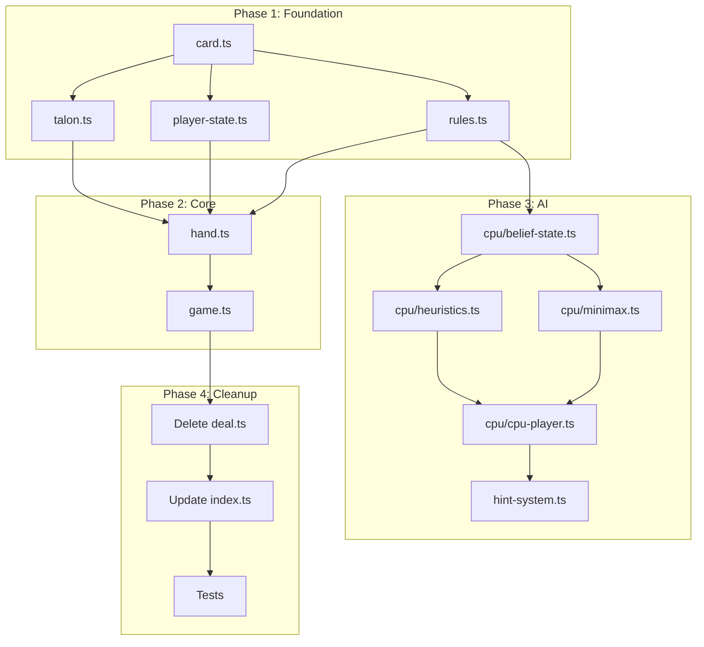

# Schnapsen Game Logic - Revised Implementation Plan

## Overview

A **maintainable, modular** implementation for Human vs CPU Schnapsen, focusing on separation of concerns and testability.

---

## Architecture Analysis

### Current Issues

| File | Problem |
|------|---------|
| `deal.ts` | **Monolithic** - 210 lines handling 6+ responsibilities (deck, hands, talon, scoring, marriages, tricks, validation) |
| `schnapsen-game.ts` | Thin wrapper with excessive delegation - almost every method just calls `currentDeal.xxx()` |
| `types.ts` | ✅ Good - clean type definitions |
| `trick.ts` | ✅ Good - single responsibility |

### Proposed Architecture

Break the monolithic `Deal` class into focused, single-responsibility modules:

```
src/gamelogic/
├── types.ts              # Types & constants (KEEP)
├── card.ts               # Card utilities, deck creation (NEW)
├── trick.ts              # Single trick resolution (KEEP)
├── talon.ts              # Talon/draw pile management (NEW)
├── player-state.ts       # Per-player state (hand, points, tricks) (NEW)
├── rules.ts              # Play validation rules (NEW)
├── hand.ts               # Single hand/round orchestration (REPLACES deal.ts)
├── game.ts               # Multi-hand game orchestration (REPLACES schnapsen-game.ts)
├── cpu/                  # CPU AI module (NEW)
│   ├── belief-state.ts   # Card tracking & inference
│   ├── heuristics.ts     # Phase 1 strategy
│   ├── minimax.ts        # Phase 2 solver
│   └── cpu-player.ts     # Main CPU interface
├── hint-system.ts        # Beginner suggestions (NEW)
└── index.ts              # Public exports (KEEP)
```

---

## Module Responsibilities

### ✅ Keep As-Is

#### `types.ts`
- Card, Suit, Rank types
- Player types
- Game phases
- Result interfaces

#### `trick.ts`
- Lead/follow card mechanics
- Winner determination
- Points calculation

---

### 🔄 Refactor

#### `card.ts` (NEW)
Extract from `deal.ts`:
```typescript
// Pure functions for card operations
export function createDeck(): Card[];
export function shuffleDeck(deck: Card[]): Card[];
export function getCardValue(card: Card): number;
export function compareCards(a: Card, b: Card, trumpSuit: Suit): number;
export function cardsEqual(a: Card, b: Card): boolean;
```

#### `talon.ts` (NEW)
Extract talon logic:
```typescript
export class Talon {
  constructor(cards: Card[], trumpCard: Card);
  
  draw(): Card | null;
  getTrumpCard(): Card;
  exchangeTrumpJack(jack: Card): Card;
  close(): void;
  
  getState(): TalonState;
  getSize(): number;
  canClose(): boolean;
  canExchange(): boolean;
}
```

#### `player-state.ts` (NEW)
Extract per-player state:
```typescript
export class PlayerState {
  constructor(playerId: Player);
  
  // Hand management
  addCards(cards: Card[]): void;
  removeCard(card: Card): void;
  getHand(): readonly Card[];
  hasCard(card: Card): boolean;
  
  // Scoring
  addTrickPoints(points: number): void;
  addMarriagePoints(points: number): void;
  incrementTricksWon(): void;
  
  getTrickPoints(): number;
  getMarriagePoints(): number;
  getTotalPoints(): number;
  getTricksWon(): number;
  hasWonTrick(): boolean;
  
  // Marriages
  getAvailableMarriages(): Suit[];
  hasMarriage(suit: Suit): boolean;
}
```

#### `rules.ts` (NEW)
Extract validation logic:
```typescript
export function getValidPlays(
  hand: Card[],
  leadCard: Card | null,
  talonState: TalonState,
  trumpSuit: Suit
): Card[];

export function isValidPlay(
  card: Card,
  hand: Card[],
  leadCard: Card | null,
  talonState: TalonState,
  trumpSuit: Suit
): boolean;

export function canDeclareMarriage(
  player: PlayerState,
  suit: Suit,
  isFirstTrick: boolean,
  isDealer: boolean
): boolean;

export function calculateHandResult(
  winner: Player,
  opponentPoints: number,
  opponentTricks: number,
  wasClosed: boolean,
  closerFailed: boolean
): HandResult;
```

---

### 🆕 New Orchestration Layer

#### `hand.ts` (REPLACES `deal.ts`)
Single hand/round orchestration using composed modules:
```typescript
export class Hand {
  private talon: Talon;
  private players: Map<Player, PlayerState>;
  private currentTrick: Trick;
  private tricksPlayed: number;
  private closedBy: Player | null;
  
  constructor(dealer: Player);
  
  // Actions
  playCard(player: Player, card: Card): TrickResult | null;
  declareMarriage(player: Player, suit: Suit): number;
  exchangeTrumpJack(player: Player): void;
  closeTalon(player: Player): void;
  goOut(player: Player): HandResult;
  
  // State queries
  getTurnPlayer(): Player;
  getLeader(): Player;
  getAvailableActions(player: Player): Action[];
  isComplete(): boolean;
  
  // For UI/CPU
  getVisibleState(forPlayer: Player): VisibleGameState;
}
```

#### `game.ts` (REPLACES `schnapsen-game.ts`)
Multi-hand game orchestration:
```typescript
export class Game {
  private gamePoints: Map<Player, number>;
  private currentHand: Hand | null;
  private dealer: Player;
  private handsPlayed: number;
  
  constructor();
  
  startGame(): void;
  startNewHand(): void;
  endHand(result: HandResult): void;
  
  getGamePoints(player: Player): number;
  getWinner(): Player | null;
  isGameOver(): boolean;
  getCurrentHand(): Hand | null;
}
```

---

## CPU AI Module

#### `cpu/belief-state.ts`
```typescript
export class BeliefState {
  constructor(knowledge: VisibleGameState);
  
  getUnknownCards(): Card[];
  getOpponentHand(): Card[] | null; // Only when talon exhausted
  samplePossibleHands(count: number): Card[][];
  recordOpponentMarriage(suit: Suit): void;
}
```

#### `cpu/heuristics.ts`
```typescript
// Phase 1 strategies as pure functions
export function shouldProtectTen(card: Card, unknownCards: Card[]): boolean;
export function findSingletonToLead(hand: Card[], trumpSuit: Suit): Card | null;
export function shouldExchangeTrumpJack(trumpCard: Card): boolean;
export function wouldBreakMarriage(card: Card, hand: Card[]): boolean;
export function selectLeadCard(hand: Card[], state: BeliefState): Card;
export function selectFollowCard(hand: Card[], leadCard: Card, state: BeliefState): Card;
```

#### `cpu/minimax.ts`
```typescript
// Phase 2 perfect solver
export function solve(
  cpuHand: Card[],
  oppHand: Card[],
  cpuPoints: number,
  oppPoints: number,
  trumpSuit: Suit
): { bestMove: Card; score: number };
```

#### `cpu/cpu-player.ts`
```typescript
export class CpuPlayer {
  private beliefState: BeliefState;
  
  constructor();
  
  decideAction(state: VisibleGameState): CpuAction;
  selectCard(state: VisibleGameState): Card;
  shouldClose(state: VisibleGameState): boolean;
  shouldExchange(state: VisibleGameState): boolean;
  getMarriageToDecl(state: VisibleGameState): Suit | null;
}
```

---

## Hint System

#### `hint-system.ts`
```typescript
export interface Hint {
  recommendedCard: Card;
  reasoning: string;
  confidence: 'high' | 'medium' | 'low';
  alternatives?: { action: string; explanation: string }[];
}

export function getHint(state: VisibleGameState): Hint;
```

---

## Migration Path

### Phase 1: Foundation (Non-Breaking)
1. Create `card.ts` with deck utilities
2. Create `player-state.ts` 
3. Create `talon.ts`
4. Create `rules.ts`

### Phase 2: Refactor Core (Breaking)
5. Create `hand.ts` using new modules
6. Update `game.ts` to use `Hand`
7. Delete old `deal.ts`
8. Rename `schnapsen-game.ts` to `game.ts`

### Phase 3: CPU AI
9. Create `cpu/` module
10. Create `hint-system.ts`

### Phase 4: Tests
11. Unit tests for pure functions
12. Integration tests for Hand/Game

---

## File Changes Summary

| Action | File | Description |
|--------|------|-------------|
| KEEP | `types.ts` | No changes needed |
| KEEP | `trick.ts` | No changes needed |
| NEW | `card.ts` | Deck creation, card utilities |
| NEW | `talon.ts` | Talon/draw pile management |
| NEW | `player-state.ts` | Per-player state management |
| NEW | `rules.ts` | Play validation, scoring rules |
| NEW | `hand.ts` | Single hand orchestration |
| RENAME | `schnapsen-game.ts` → `game.ts` | Simplified game orchestration |
| DELETE | `deal.ts` | Replaced by modular components |
| NEW | `cpu/belief-state.ts` | Card inference |
| NEW | `cpu/heuristics.ts` | Phase 1 AI |
| NEW | `cpu/minimax.ts` | Phase 2 AI |
| NEW | `cpu/cpu-player.ts` | CPU interface |
| NEW | `hint-system.ts` | Beginner hints |
| MODIFY | `index.ts` | Update exports |

---

## Benefits of This Architecture

| Benefit | How |
|---------|-----|
| **Testability** | Pure functions in `rules.ts`, `heuristics.ts` are easy to unit test |
| **Maintainability** | Each file has one clear purpose |
| **Reusability** | `BeliefState` powers both CPU and hint system |
| **Readability** | ~50-100 lines per file instead of 200+ |
| **Debuggability** | Clear boundaries make issues easy to isolate |

---

## Verification Plan

### Automated Tests

**Existing:** `test/hello.test.ts` (placeholder)

**New Tests to Create:**

```bash
test/
├── card.test.ts          # Deck creation, shuffling
├── rules.test.ts         # Play validation, scoring
├── talon.test.ts         # Talon operations
├── player-state.test.ts  # Player state management
├── hand.test.ts          # Hand orchestration
├── cpu/
│   ├── heuristics.test.ts
│   └── minimax.test.ts
└── integration/
    └── full-game.test.ts
```

**Run Tests:**
```bash
npm test
```

### Manual Verification
1. Play a full game against CPU
2. Verify hint system shows reasonable suggestions
3. Verify strict rules apply after talon closes

---

## Execution Order


